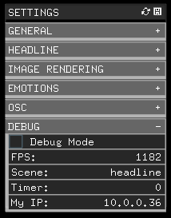
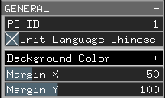
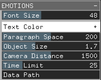
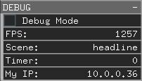

# A&T@2020: UNKNOWN (remote-server, local-server, newsHeadlinesApp)

This README file contains the instructions on how to setup and run the distributed system behind the project UNKNOWN. These 3 APPs are not the complete system. Other parts were developed by different memebers of the team. All APPs in this manual have been developed using Linux: Ubuntu 20.04 LTS. It is strongly recommended to use the same version of Linux on the devices you will use to run this system.

Author: Fito Segrera

## Table of contents:

- [remote-server](#remote-server)
  - [Requirements](#Requirements)
  - [Installation](#Installation)
  - [Errors](#Errors)
- [local-server](#local-server)
  - [Requirements](#Requirements)
    - [NodeJs](#NodeJs)
    - [Runwayml](#Runwayml)
  - [Installation](#Installation)
- [newsHeadlinesApp](#newsHeadlinesAPP)
  - [OpenFrameworks](#OpenFrameworks)
  - [Addons](#Addons)
  - [Setup](#Setup)
  - [Configuration](#Configuration)
- [Running The System](#Run-The-System)

# remote-server

Because of internet restrictions and regulations in mainland China, this APP has been created with the only purpose of bridging the local-server APP with the news API and Amazon Translation API. We are currently using Alibaba Cloud services to host our APP. Please ask the system's Administrator for the url, login and password of this server.

## Requirements

A linux server is required, UBUNTU-server is prefered. You need the SSH credentials in order to access this server. Once you have the credentials, you can login throug a unix terminal using the following command (assuming your ip is 47.57.78.73):

        ssh root@47.57.78.73

When prompted please type your root password.

## Installation

1.  Install nodeJs on the server. Please first login to your server using ssh on a terminal and use the following commands:

        sudo apt install nodejs

2.  Then install node package manager:

        sudo apt install npm

3.  Upload the remote-server application to the server. You can compress the folder into a .zip and use the "scp" command to upload the file. Or just download a remote file manager like [filezilla](https://filezilla-project.org/) and make it simple.

4.  Once you have the APP on your server, cd into the directory:

        cd remote-server/

5.  Install all nodeJs dependencies:

        npm install

6.  Install Forever JS:

        npm install -g forever

7.  Run the server using forever:

        forever start server.js

## Errors

In case your server's port is blocked by default and your nodejs APP is not accessible from the web, please read: How to configure ubuntu server to access a nodejs app in port 3000 remotely [TUTORIAL](https://www.codementor.io/@tomgeraghty/hosting-an-express-server-nodejs-application-with-linode-e1j7wt7mr)

# local-server

The local-server is a nodeJS application which controls and monitors the entire system.

## Requirements

### NodeJs

### Runwayml

Runwayml is a visual interface framework designed for creative use of Machine Learning. More information of this project [HERE](https://runwayml.com/).

1.  Download and install Runway ML from this [LINK](https://runwayml.com/)

2.  Run Runway ML and log in with the credentials provided (ASK FITO).

3.  Choose the option "browse models" and search for "AttnGAN Text To Image Generation".

4.  When prompted, create a new workspace with the name _txt2img_

5.  Within the new workspace screen search for the _advanced options_ on the bottom right corner on top of the red run model button. Change _run location_ to _local_.

6.  Now you might see a message saying docker is not available. If so please refer to **step 7**.

7.  We need to install docker in Ubuntu in order to run the AI model locally. Install docker on Ubuntu 20.04 with the following commands:

        sudo apt remove docker docker-engine docker.io containerd runc

        curl -fsSL https://download.docker.com/linux/ubuntu/gpg | sudo apt-key add -

        sudo add-apt-repository "deb [arch=amd64] https://download.docker.com/linux/ubuntu eoan stable"

        sudo apt update && sudo apt install docker-ce docker-ce-cli containerd.io

**(OPTIONAL)** More detailed instructions HERE](https://computingforgeeks.com/how-to-install-docker-on-ubuntu/). Notice we have changed the line:

        sudo add-apt-repository "deb [arch=amd64] https://download.docker.com/linux/ubuntu bionic stable stable"

For:

        sudo add-apt-repository "deb [arch=amd64] https://download.docker.com/linux/ubuntu eoan stable"

This is because at the time of developing this project, docker did't yet release the version for ubuntu 20.02 "focal" so we installed the previous version "eoan". More details on the fix [HERE](https://forums.docker.com/t/cant-install-docker-on-ubuntu-20-04/93058/3)

8.  To create the docker group and add your user:

        sudo groupadd docker

9.  Add your user to the docker group.

        sudo usermod -aG docker \$USER

10. Log out and log back in so that your group membership is re-evaluated. On Linux, you can also run the following command to activate the changes to groups:

        newgrp docker

11. Verify that you can run docker commands without sudo.

        docker run hello-world

If you need more information check out the official docker documentation: [LINK](https://docs.docker.com/install/linux/linux-postinstall/)

**Important Note:** If after doing the steps descibed above Runways still can't detect docker, please reboot the machine and try again.

# newsHeadlinesAPP

This application runs on 5 Lattepandas mini-pcs runing Ubuntu 20.04 LTS. They are all networked to the application called "local-server" which distributes the entire system.

## OpenFrameworks

Built and tested with openframeworks (of_v0.11.0_linux64gcc6_release) running on UBUNTU 20.04 LTS. We kept a copy of this version of openframeworks on the following path:

    /assets/of_v0.11.0_linux64gcc6_release.tar.gz

Instructions on how to install openframeworks [HERE](https://openframeworks.cc/download/)

## Addons

- ofxGui (included with the used version of openframeworks)
- ofxOsc (included with the used version of openframeworks)
- ofxAssimpModelLoader (included with the used version of openframeworks)
- ofxTrueTypeFontUC -> [GITHUB](https://github.com/hironishihara/ofxTrueTypeFontUC)

**IMPORTANT NOTE:** The original ofxTrueTypeFontUC library was giving errors when compiled. The problem was fixed by adding the line: #include "ofMain.h" to the header file (ofxTrueTypeFontUC.h). Please, **_if you need to compile this application from source_**, make sure you do the #include on top of all other #includes (it should be the first). You can also just find the modified version in the following path:

      		/assets/libraries_backup/ofxTrueTypeFontUC

## Setup

This instructions asume you are setting this app up on a device running ubuntu 20.04. Be mindfull that you have to replace vX_X with whatever version of the app you re working with, ei. newsHeadlinesApp_v0_8

1.  Move the newsHeadlinesApp_vX_X to your desired location.

2.  Open a terminal and cd into the newsHeadlinesApp_vX_X

3.  We need to execute the emotions APP located within the bin/data/ folder:

        cd newsHeadlinesApp_vX_X/bin/data/emotions/Python

    Then run:

        python3 emo.py

4.  On another terminal tab cd into the osc testing server:

        cd newsHeadlinesApp_vX_X/bin/data/nodeTestOSC

    Then run:

        node server.js

    **IMPORTANT NOTE:**If nodeJs is not installed please run the following commands:

        sudo apt update

        sudo apt install nodejs

        sudo apt install npm

    Finally, within the nodeTestOSC folder run the following command:

        npm install

    If errors appear, try with sudo:

        sudo npm install

5.  Before running the main APP we need to change the orientation of the display. Open ubuntu's system settings and find the display tab on the left menu. Click on orientation and change it to portrait left or right.

6.  Once your emo.py and server.js are running on different terminal tabs and the system display is on portrait mode, open a new terminal tab and cd into the newsHeadlinesAPP_vX_X executable file.

        cd newsHeadlinesAPP_vX_X/bin

7.  Run the application:

        ./newsHeadlinesAPP_vX_X

## Configuration

A configuration GUI hass been added to the APP. In order to bring up the configuration interface please press the letter 's' on the keyboard.

1.  The save icon located at the right of the top SETTINGS bar is used to save any chages done to the APP through this GUI. **WARNING:** Changes cannot be undone after saving. All saved settings are kept on a local file:

        newsHeadlinesApp_vX_X/bin/data/settings.xml

    A backupsettings file is provided in case the original settings values are needed after many savings...

        newsHeadlinesApp_vX_X/bin/data/default.xml

2.  The load icon (located at the left of the save icon) enables the user to load any previous settings before the "save" icon is pressed.

3.  **GENERAL** tab:

    

    - _PC ID:_ (string) Each screen running this APP should have an ID value in the range 1 to 5. Please change this value on each screen and save the settings accordingly.

    - _Init Language Chinese_: (boolean) value to tell the application to start or not with Chinese data. False means the application starts with English Language.

    - _Background Color_: (ofColor) Background color of the entire APP.

    - _Margin X and MarginY_: (int) This are the rendering margins for all TEXTS in the APPlication. It does not apply to the image scene which renders edge to edge.

4.  **HEADLINES** tab:

    

    - _Font Size_: (int) Headlines font size.

    - _Margin Fix_: (float) correct error that happens when a character from the headline is rendered outside of the right margin of the screen. **IMPORTANT NOTE:** Applies to chinese ONLY!

    - _Auto Correct -_ : (bool) auto correct function which tries to remove the " - news source" at the end of each headline. The function also removes all extra white spaces. **WARNING:** this is an experimental approach, unexpected results might happen due to potential rare uses of the dash character, on the side of the news source. Examples:

      **Original:** "Trump pushes fights over - racist - legacy while much of America moves in a different direction - The Washington Post"

      **Auto Correct:** "Trump pushes fights over racist legacy while much of America moves in a different direction"

      **Original:** "Third-world countries struggle as Covid-19 death-tolls rise - The New York Times"

      **Auto Correct:** "Third-world countries struggle as Covid-19 death-tolls rise"

    - _Headline Color_: (ofColor) Color of the headline text.

    - _Time-Limit_: (int) The time in seconds for the headline to be displayed.

5.  **IMAGE RENDERING** tab:

    

    - _Remaining Passes_: (int) Displays the number of passes left to render during the image rendering process. (It is a READ ONLY setting, cannot be modified).

    - _Max Passes_: (int) Maximum passes for the render engine. On the latte panda between 400 and 500 have shown a good speed vs quality result at FULL HD. The lower this value the faster the image is rendered but less sharpness.

    - _Max Range_: (int) The maximum ammount of pixels to be rendered in a single render pass.

    - _Pixel Size Min_: (int) The smallest pixel size to be rendered.

    - _Pixel Size Max_: (int) The biggest pixel size to be rendered.

    - _Range Increment_: (float) The exponential increment factor of the renderer. The higher this value the faster the image is rendered.

6.  **EMOTIONS** tab:

    

    - _Font Size_: (int) Size of the displayed Text during the emotions data scene.

    - _Text Color_: (ofColor) Color of the displayed text.

    - _Paragraph Space_: (int) Space between paragraphs.

    - _Object Size_: (float) Sizeof 3D model.

    - _Camera Distance_: (int) Distance from the camera to the 3D model.

    - _Time Limit_: (int) Time in seconds for the duration of this scene.

    - _Data Path_: (string) Path where the emotions.json file is saved. **IMPORTANT NOTE:** If you hover the mouse over this panel it will display the default path. Please dont change unles you move the location of this file.

7.  **OSC** tab:

    

    This secction is devided into 4 sub-sections:

    - \_OSC RECEIVER\_\_: (string) Here you can change the PORT of all incoming messages.

    - _OSC HEADLINE SENDER_: (string) Here you can change the IP address, PORT and Timeout for the communication with the headline local server. The timeout determines how many seconds pass before another connection attempt happens. This is just in case the headline server is offline.

    - _OSC EMOTIONS SENDER_: (string) Here you can change the IP address, PORT and Timeout for the communication with the emotions APP. The timeout determines how many seconds pass before another connection attempt happens. This is just in case the emotions APP is offline.

    - _OSC GALAXY SENDER_: (string) Here you can change the IP address and PORT for the communication with the GALAXY rendering PC.

8.  **DEBUG** tab:

    

    - _Debug Mode_: (boolean) Turns ON and OFF the Debug Mode which allows you to see margins, coordinates, spaces, text bounding boxes, OSC data, etc.

    - _OSC Debug Console_: (boolean) Turns ON and OFF a terminal/console which shows incoming and outgoing OSC messages.

    - _FPS_: (READ-ONLY) Framerate of the APP.

    - _Scene_: (READ-ONLY) Display the current scene (headline, image, emotions).

    - _Timer_: (READ-ONLY) The remaining time of the current scene.

    - _My IP_: (READ-ONLY) The IP address of the local machine.

# Run-The-System
